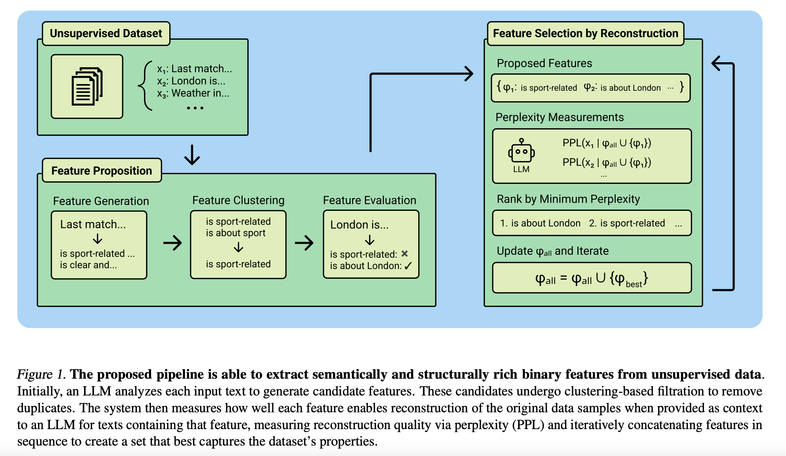
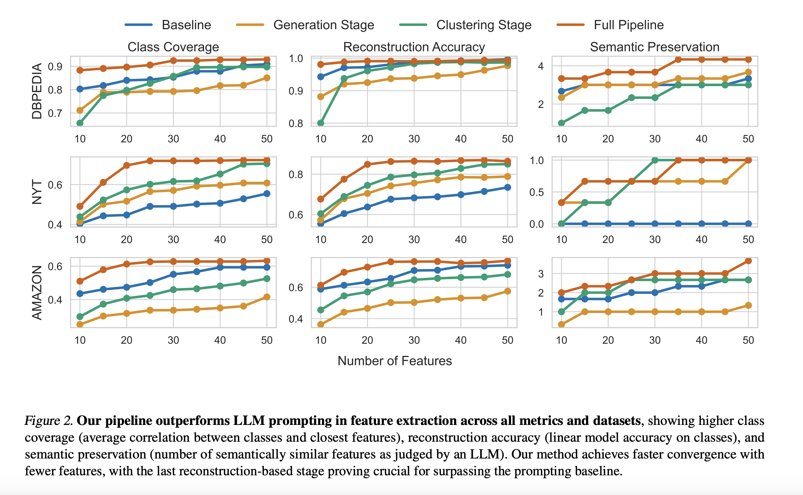

# Dataset Featurization: Uncovering Natural Language Features through Unsupervised Data Reconstruction

<a href="https://www.arxiv.org/abs/2502.17541"></a>

**Authors:**
[Michal Bravansky](https://bravansky.com/),
[Vaclav Kubon](https://www.linkedin.com/in/vaclavkubon/),
[Suhas Hariharan](https://scholar.google.com/citations?user=wC2ujJthFt4C&hl=en),
[Robert Kirk](https://robertkirk.github.io/)

We present Dataset Featurization, a technique for finding natural-language features in a fully automatic and unsupervised way. We reformulate feature selection to select features that minimize perplexity over the dataset, effectively using LLM-based data reconstruction to ensure only the most informative features remain.



## Overview

Our multi-stage pipeline:

1️⃣ **Feature Generation**: 
   - Prompt an LLM to propose candidate features for each text
   - Cluster and assign binary truth values to texts
   - Create a table that indicates whether each feature is present in each string
   
2️⃣ **Featurization**: 
   - For each feature, measure perplexity reduction on texts where it appears
   - Iteratively chain features in context that most reduce perplexity
   - Produce a final set of features

## Getting Started

### Prerequisites

1. Install the required dependencies:
```bash
pip install -r requirements.txt
```

2. Create a `.env` file in the root directory with your API keys:
```bash
OPENAI_API_KEY=your_openai_key
   
# Wandb is optional
WANDB_PROJECT=your_project_name
WANDB_USERNAME=your_username
WANDB_MODE=your_mode
```

3. Set up the `config.py` (primarily the dataset and the prompt template used during featurization)
   
### Usage

1. Generate candidate features from your dataset:
```bash
python generation.py
```

2. Featurize your dataset:
```bash
python featurization.py
```

## Results

📊 We first test our method on datasets with pre-existing ground-truth labels, reconstructing original labels without supervision. Our method outperforms in-context feature generation, and we show each stage of the pipeline is vital for performance. You can explore the results and produced features in `experiments.`



## Case Studies

We apply Dataset Featurization to two case studies in AI safety and alignment research, replicable through `case studies`:

### Jailbreak Generation

We apply Dataset Featurization to jailbreaks constructed from human-crafted attacks in [WildTeaming](https://x.com/liweijianglw/status/1806790756507730227). We condense 500 diverse tactics into just 20 features, keeping similar effectiveness & diversity! Results are even stronger when featurizing only successful jailbreaks.

### Compositional Preference Modeling

Building on top of [compositional preference models](https://arxiv.org/abs/2310.13011), we featurize SHP & HH-RLHF data to build compositional preference models matching expert-crafted features. Our scalable, automatic approach achieves comparable or better performance while avoiding labor-intensive manual design.

## Paper

Full paper: [arXiv:2502.17541](https://arxiv.org/abs/2502.17541)

### Citation

```
@article{bravansky2025dataset,
  title={Dataset Featurization: Uncovering Natural Language Features through Unsupervised Data Reconstruction},
  author={Bravansky, Michal and Kubon, Vaclav and Hariharan, Suhas and Kirk, Robert},
  journal={arXiv preprint arXiv:2502.17541},
  year={2025}
}
```